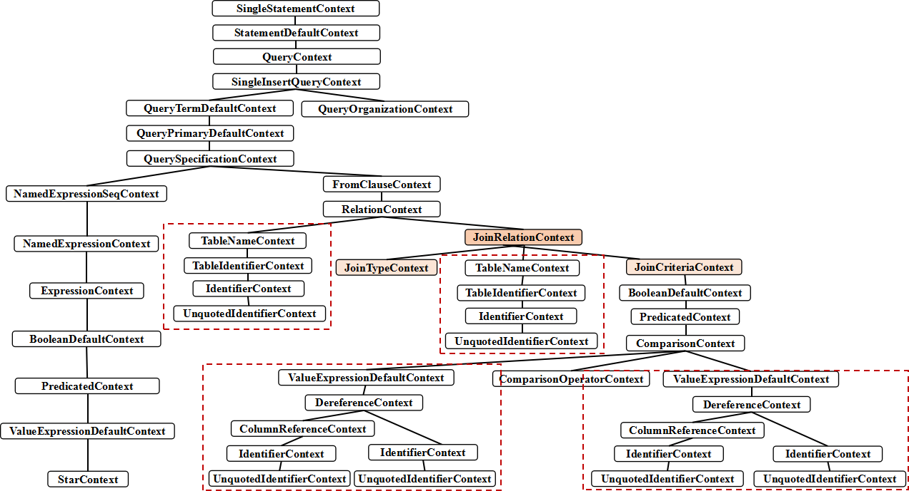
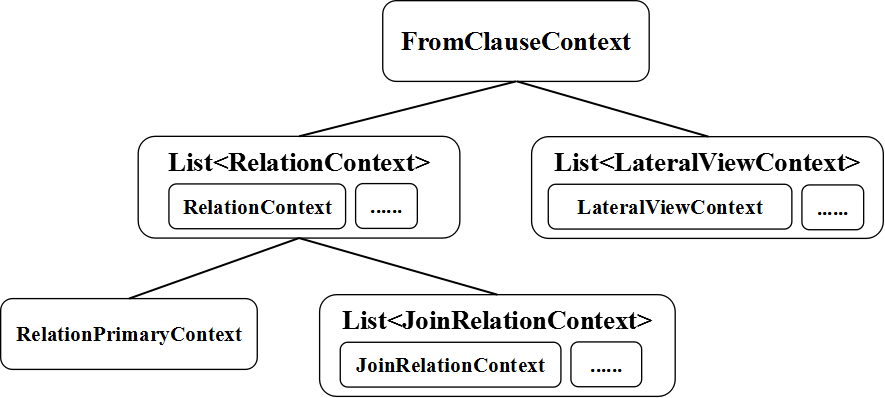
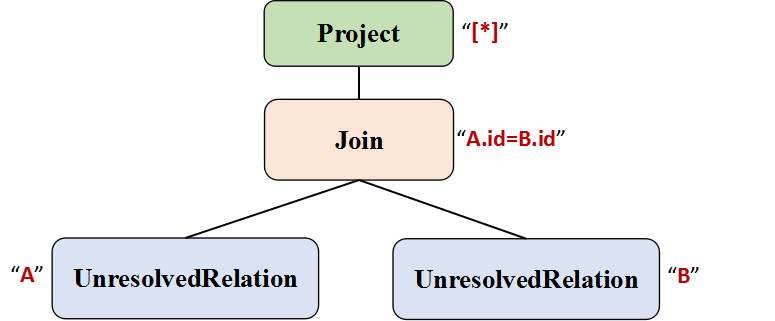
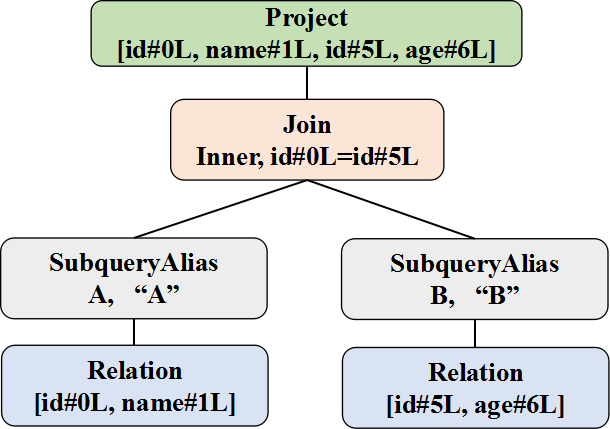
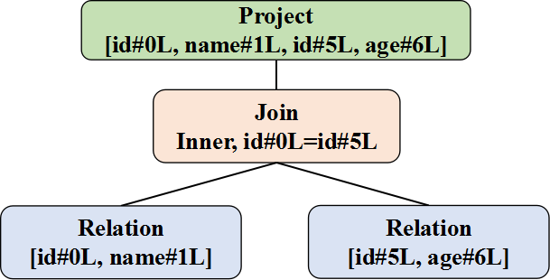
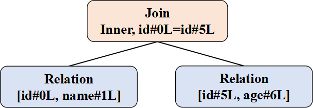
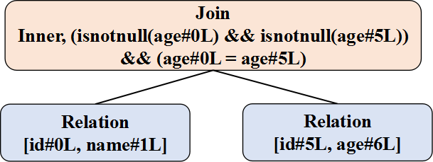
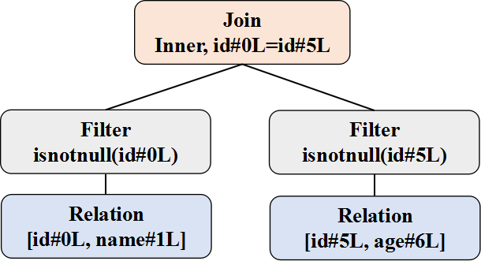

#                       Spark SQL Join实现原理

## 1. Join操作概述

关系代数中，Join一直都是最为复杂的操作。在分布式环境下，Join涉及到大量的数据shuffle操作，因此一直是优化重点。这里以一条简单的SQL查询语句为例，分析整个流程。

```sql
                            select * from A join B on A.id = B.id
```

### 1.1 文法定义

在ANTLR4的文法文件中，Join表达式相关的定义如下：

```
fromClause : FROM relation (',' relation)* lateralView* ;

relation : relationPrimary joinRelation* ;

joinRelation
    : (joinType) JOIN right=relationPrimary joinCriteria?
    | NATURAL joinType JOIN right=relationPrimary
    ;

joinType
    : INNER?
    | CROSS
    | LEFT OUTER?
    | LEFT SEMI
    | RIGHT OUTER?
    | FULL OUTER?
    | LEFT? ANTI
    ;

joinCriteria : ON booleanExpression | USING '(' identifier (',' identifier)* ')';
```

由此可见，Join表达式处于From语句中，是针对数据源的操作。JoinType代表Spark-SQL中目前所支持的Join类型，包括Inner，FullOuter，LeftOuter，RightOuter，LeftSemi，LeftAnti和Cross七种，对应关键字如表所示：

|              查询关键字               |   Join类型   |
| :------------------------------: | :--------: |
|             "inner"              |   Inner    |
| "outer" \| "full" \| "fullouter" | FullOuter  |
|      "leftouter" \| "left"       | LeftOuter  |
|     "rightouter" \| "right"      | RightOuter |
|            "leftsemi"            |  LeftSemi  |
|            "leftanti"            |  LeftAnti  |
|             "cross"              |   Cross    |

如果需要自定义开发其它类型的Join操作，首先需要修改的就是这部分定义。顾名思义，JoinCriteria代表的是Join操作的条件部分，SQL语句中支持`ON`和`USING`关键字。

### 1.2 抽象语法树(AST)

编译器由ANTLR4自动生成，针对该SQL语句生成如下AST：



### 1.3 逻辑算子树(Logical Plan)

逻辑算子树的生成包括两步：

(1)生成未解析的逻辑算子树，即Unresolved Logical Plan，主要在Catalyst的AstBuilder完成

(2)生成解析完毕的逻辑算子树，即Resolved Logical Plan，由Catalyst的Analyzer完成

#### 1.3.1 生成Unresolved Logical Plan

主要的逻辑在AstBuilder中，核心涉及到以下几个函数

```scala
  override def visitFromClause(ctx: FromClauseContext): LogicalPlan = withOrigin(ctx) {
    val from = ctx.relation.asScala.foldLeft(null: LogicalPlan) { (left, relation) =>
      val right = plan(relation.relationPrimary)
      val join = right.optionalMap(left)(Join(_, _, Inner, None))
      withJoinRelations(join, relation)
    }
    ctx.lateralView.asScala.foldLeft(from)(withGenerate)
  }
```

对于from clause中的每个relation以逗号划分，类似于`from relation, relation, ...`；每个relation中通常会有join操作，因此把一个relation中的join操作映射为二叉树。传入join方法`ctx`的用于指明该Join操作的类型，是InnerJoin还是OuterJoin，其中NATURA-JOIN是一种特殊类型的EQUI-JOIN，当两张表的Join keys具有相同名字，并且对应的列数据类型相同。




```scala
  override def visitRelation(ctx: RelationContext): LogicalPlan = withOrigin(ctx) {
    withJoinRelations(plan(ctx.relationPrimary), ctx)
  }

  private def withJoinRelations(base: LogicalPlan, ctx: RelationContext): LogicalPlan = {
    ctx.joinRelation.asScala.foldLeft(base) { (left, join) =>
      withOrigin(join) {
        val baseJoinType = join.joinType match {
          case null => Inner
          case jt if jt.CROSS != null => Cross
          case jt if jt.FULL != null => FullOuter
          case jt if jt.SEMI != null => LeftSemi
          case jt if jt.ANTI != null => LeftAnti
          case jt if jt.LEFT != null => LeftOuter
          case jt if jt.RIGHT != null => RightOuter
          case _ => Inner
        }

        // Resolve the join type and join condition
        val (joinType, condition) = Option(join.joinCriteria) match {
          case Some(c) if c.USING != null =>
            (UsingJoin(baseJoinType, c.identifier.asScala.map(_.getText)), None)
          case Some(c) if c.booleanExpression != null =>
            (baseJoinType, Option(expression(c.booleanExpression)))
          case None if join.NATURAL != null =>
            if (baseJoinType == Cross) {
              throw new ParseException("NATURAL CROSS JOIN is not supported", ctx)
            }
            (NaturalJoin(baseJoinType), None)
          case None =>
            (baseJoinType, None)
        }
        Join(left, plan(join.right), joinType, condition)
      }
    }
  }
```
经过递归调用，该SQL语句最终生成如下的算子树



1.3.2 生成Resolved Logical Plan

Analyzer的规则涉及到resolve Join的规则有：ResolveReferences和ResolveNaturalAndUsingJoin。针对本例，解析流程对应的是ResolveReference中逻辑：

    /**
     * Generate a new logical plan for the right child with different expression IDs
     * for all conflicting attributes.
     */
    private def dedupRight (left: LogicalPlan, right: LogicalPlan): LogicalPlan = {
      val conflictingAttributes = left.outputSet.intersect(right.outputSet)
      ......
    }
    
    // ResolveReferences.apply
    // If the projection list contains Stars, expand it.
    case p: Project if containsStar(p.projectList) =>
      p.copy(projectList = buildExpandedProjectList(p.projectList, p.child))
    ...................................
    case j @ Join(left, right, _, _) if !j.duplicateResolved =>
      j.copy(right = dedupRight(left, right))

根据该逻辑，如果Join操作存在重名的属性(即左右子节点的输出属性名集合有重叠)，那么就调用dedupRight方法将右子节点对应的Expression用一个新的Expression ID表示，这样即使出现同名，经过处理之后Expression ID也不相同，因此可以区分。

总而言之，Analyzer所起到的作用就是将一些catalog信息添加到Unresolved Logical Plan中，并对其进行若干的调整，例如加入别名信息(SubqueryAlias)等。经过这一步，最终的Logical Plan算子树如下：




### 1.4 优化处理(Optimized Logical Plan)

通过Optimizer来对逻辑算子树进行优化，对于这条语句，起作用的优化规则分别是：

**EliminateSubqueryAliases**：消除别名

```scala
/**
 * Removes [[SubqueryAlias]] operators from the plan. Subqueries are only required to provide
 * scoping information for attributes and can be removed once analysis is complete.
 */
object EliminateSubqueryAliases extends Rule[LogicalPlan] {
  def apply(plan: LogicalPlan): LogicalPlan = plan transformUp {
    case SubqueryAlias(_, child, _) => child
  }
}
```



**ColumnPruning**：列剪裁

```scala
object ColumnPruning extends Rule[LogicalPlan] {
  private def sameOutput(output1: Seq[Attribute], output2: Seq[Attribute]): Boolean =
    output1.size == output2.size &&
      output1.zip(output2).forall(pair => pair._1.semanticEquals(pair._2))

  def apply(plan: LogicalPlan): LogicalPlan = removeProjectBeforeFilter(plan transform {
    // Prunes the unused columns from project list of Project/Aggregate/Expand
    case p @ Project(_, p2: Project) if (p2.outputSet -- p.references).nonEmpty =>
      p.copy(child = p2.copy(projectList = p2.projectList.filter(p.references.contains)))
    case p @ Project(_, a: Aggregate) if (a.outputSet -- p.references).nonEmpty =>
      p.copy(
        child = a.copy(aggregateExpressions = a.aggregateExpressions.filter(p.references.contains)))
    case a @ Project(_, e @ Expand(_, _, grandChild)) if (e.outputSet -- a.references).nonEmpty =>
      val newOutput = e.output.filter(a.references.contains(_))
      val newProjects = e.projections.map { proj =>
        proj.zip(e.output).filter { case (_, a) =>
          newOutput.contains(a)
        }.unzip._1
      }
      a.copy(child = Expand(newProjects, newOutput, grandChild))

    // Prunes the unused columns from child of `DeserializeToObject`
    case d @ DeserializeToObject(_, _, child) if (child.outputSet -- d.references).nonEmpty =>
      d.copy(child = prunedChild(child, d.references))

    // Prunes the unused columns from child of Aggregate/Expand/Generate
    case a @ Aggregate(_, _, child) if (child.outputSet -- a.references).nonEmpty =>
      a.copy(child = prunedChild(child, a.references))
    case e @ Expand(_, _, child) if (child.outputSet -- e.references).nonEmpty =>
      e.copy(child = prunedChild(child, e.references))
    case g: Generate if !g.join && (g.child.outputSet -- g.references).nonEmpty =>
      g.copy(child = prunedChild(g.child, g.references))

    // Turn off `join` for Generate if no column from it's child is used
    case p @ Project(_, g: Generate)
        if g.join && !g.outer && p.references.subsetOf(g.generatedSet) =>
      p.copy(child = g.copy(join = false))

    // Eliminate unneeded attributes from right side of a Left Existence Join.
    case j @ Join(_, right, LeftExistence(_), _) =>
      j.copy(right = prunedChild(right, j.references))

    // all the columns will be used to compare, so we can't prune them
    case p @ Project(_, _: SetOperation) => p
    case p @ Project(_, _: Distinct) => p
    // Eliminate unneeded attributes from children of Union.
    case p @ Project(_, u: Union) =>
      if ((u.outputSet -- p.references).nonEmpty) {
        val firstChild = u.children.head
        val newOutput = prunedChild(firstChild, p.references).output
        // pruning the columns of all children based on the pruned first child.
        val newChildren = u.children.map { p =>
          val selected = p.output.zipWithIndex.filter { case (a, i) =>
            newOutput.contains(firstChild.output(i))
          }.map(_._1)
          Project(selected, p)
        }
        p.copy(child = u.withNewChildren(newChildren))
      } else {
        p
      }

    // Prune unnecessary window expressions
    case p @ Project(_, w: Window) if (w.windowOutputSet -- p.references).nonEmpty =>
      p.copy(child = w.copy(
        windowExpressions = w.windowExpressions.filter(p.references.contains)))

    // Eliminate no-op Window
    case w: Window if w.windowExpressions.isEmpty => w.child

    // Eliminate no-op Projects
    case p @ Project(_, child) if sameOutput(child.output, p.output) => child

    // Can't prune the columns on LeafNode
    case p @ Project(_, _: LeafNode) => p

    // for all other logical plans that inherits the output from it's children
    case p @ Project(_, child) =>
      val required = child.references ++ p.references
      if ((child.inputSet -- required).nonEmpty) {
        val newChildren = child.children.map(c => prunedChild(c, required))
        p.copy(child = child.withNewChildren(newChildren))
      } else {
        p
      }
  })
```



**InferFiltersFromConstraints**：过滤条件相关

```scala
object InferFiltersFromConstraints extends Rule[LogicalPlan] with PredicateHelper {
  def apply(plan: LogicalPlan): LogicalPlan = plan transform {
    case filter @ Filter(condition, child) =>
      val newFilters = filter.constraints --
        (child.constraints ++ splitConjunctivePredicates(condition))
      if (newFilters.nonEmpty) {
        Filter(And(newFilters.reduce(And), condition), child)
      } else {
        filter
      }

    case join @ Join(left, right, joinType, conditionOpt) =>
      // Only consider constraints that can be pushed down completely to either the left or the
      // right child
      val constraints = join.constraints.filter { c =>
        c.references.subsetOf(left.outputSet) || c.references.subsetOf(right.outputSet)
      }
      // Remove those constraints that are already enforced by either the left or the right child
      val additionalConstraints = constraints -- (left.constraints ++ right.constraints)
      val newConditionOpt = conditionOpt match {
        case Some(condition) =>
          val newFilters = additionalConstraints -- splitConjunctivePredicates(condition)
          if (newFilters.nonEmpty) Option(And(newFilters.reduce(And), condition)) else None
        case None =>
          additionalConstraints.reduceOption(And)
      }
      if (newConditionOpt.isDefined) Join(left, right, joinType, newConditionOpt) else join
  }
}
```



**PushPredicateThroughJoin**：谓词下推


